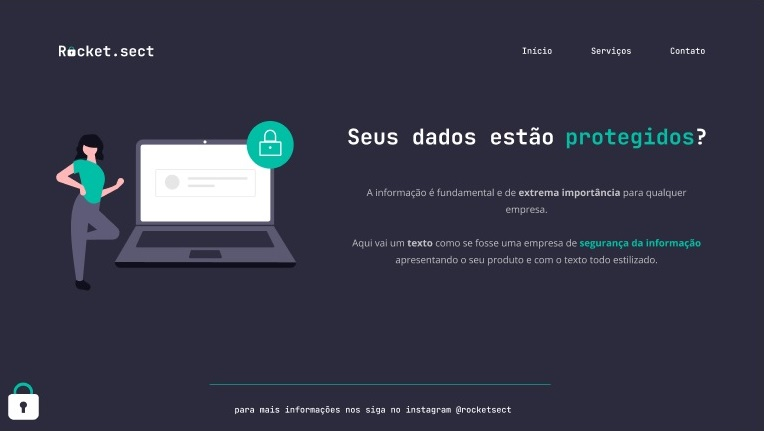

<h1 align="center"> Recriating Layout: Rocket Sect </h1>

For this challenge, we had to recreate an aplication based on it`s layout, training what we have been styding till now on Explorer course by Rocketseat.  

  <a href="#-technologies">Technology</a>&nbsp;&nbsp;&nbsp;|&nbsp;&nbsp;&nbsp;
  <a href="#-project">Project</a>

  

## 🚀 Technologies

This project was developed using the following technologies:

- HTML
- CSS
- Git e Github
- Figma

## 💻 Project

- [Visit the online project](https://pedrohfaig.github.io/Rocket-sect)

---

Developed by Pedro Henrique Faig